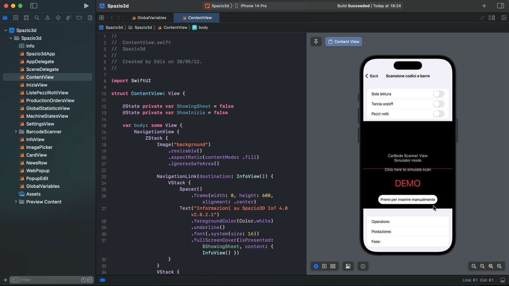
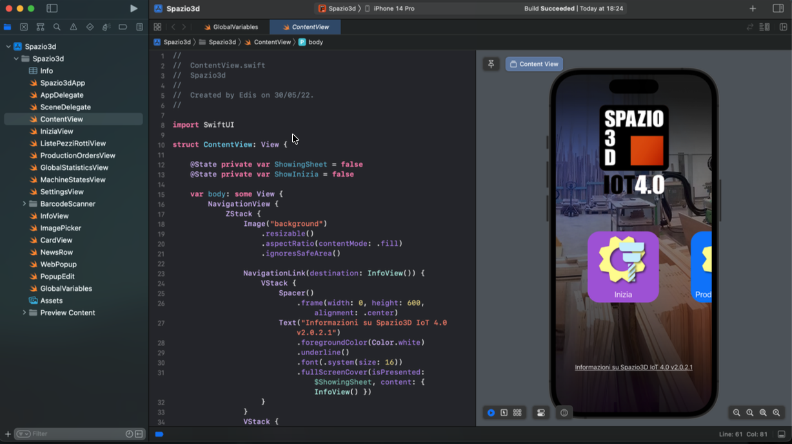
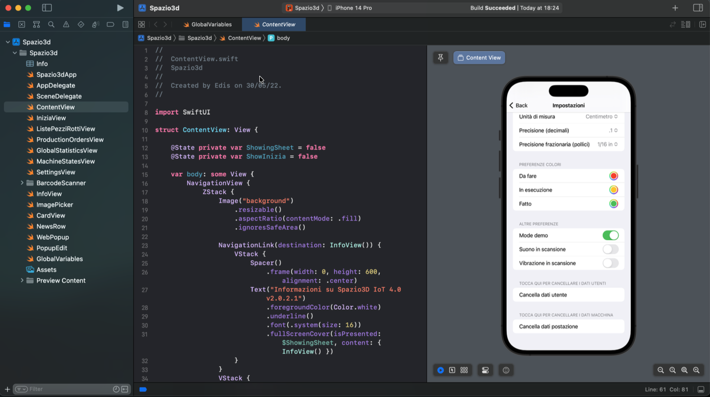

# Spazio3D - iOS App Development (Internship Project)

Progetto iOS sviluppato durante lo stage PCTO presso [**BrainSoftware S.r.l.**](https://www.brainsoftware.it/) — Fonte (TV).

## 📖 Descrizione

Spazio3D iOS è un’applicazione sviluppata in Swift durante un’esperienza aziendale reale, con l’obiettivo di replicare e adattare un software già esistente su piattaforme Android/Desktop.

L’app è progettata per interagire con sistemi CAD-CAM e processi produttivi, permettendo la lettura di codici QR per visualizzare informazioni relative a componenti, lavorazioni e stati di produzione.

> ⚠️ Questo progetto è stato sviluppato nel 2022 e potrebbe non essere completamente funzionante nelle versioni più recenti di Xcode. \
> ⚠️ Alcune dipendenze originali non sono incluse nel repository.

## 🚀 Funzionalità principali

- Sviluppo interfaccia con SwiftUI (NavigationView, VStack, ZStack)
- Implementazione della logica di navigazione tra le schermate
- Integrazione della fotocamera tramite AVFoundation per la lettura QR
- Gestione chiamate al server tramite librerie dedicate (WorkOrderClient / Halo)
- Integrazione della libreria Alamofire per richieste HTTP asincrone
- Utilizzo di async/await e DispatchQueue per la gestione concorrente
- Debugging e troubleshooting in ambiente reale

## 🛠️ Tech Stack

- **Linguaggio:** Swift 
- **IDE:** Xcode
- **Librerie:** Alamofire
- **Target:** iOS

## 📸 Screenshots

<table align="center">
  <tr>
    <td align="center">
       
      Home
    </td>
    <td align="center">
       
      QR Scan
    </td>
    <td align="center">
       
      Settings
    </td>
  </tr>
</table>

## 📌 Note

Progetto realizzato a scopo formativo durante lo stage scolastico. Il codice potrebbe non riflettere best practice attuali.

---

*Stage presso BrainSoftware S.r.l.— Fonte (TV)*
